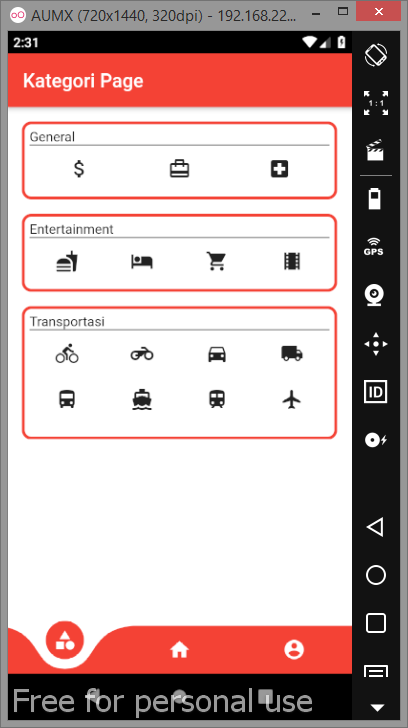
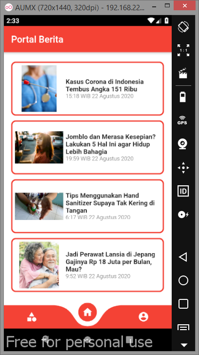
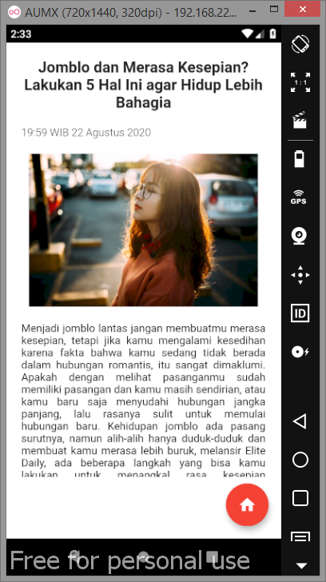
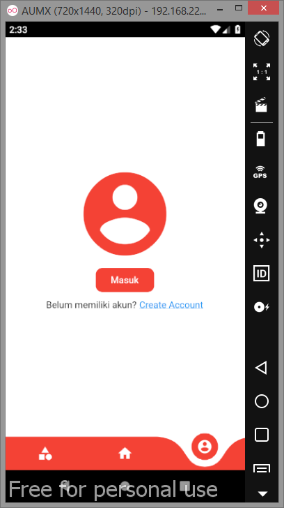
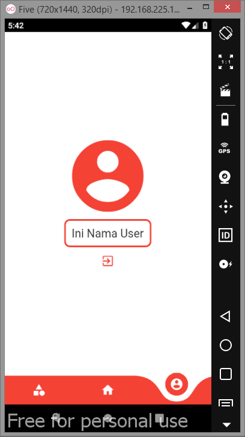
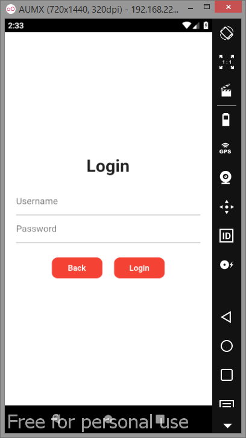
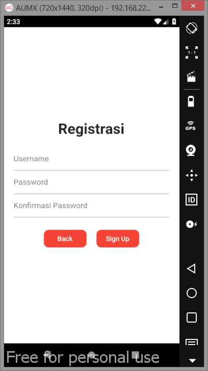

# portal_berita_lokerprogrammer
untuk tampilan dari icon filter, list resume, bookmark, dan profil masih icon dummy (blm sesuai desain)

Tampilan Kategori
 

Tampilan Home
 

Tampilan Detail
 

Tampilan Profil (belum login)
 

Tampilan Profil (sudah login)
 

Tampilan FormLogin
 

Tampilan FormRegist
 

