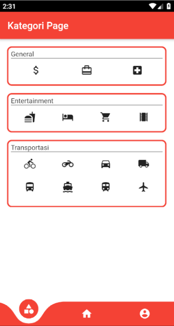
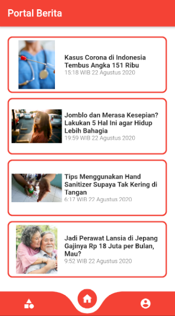
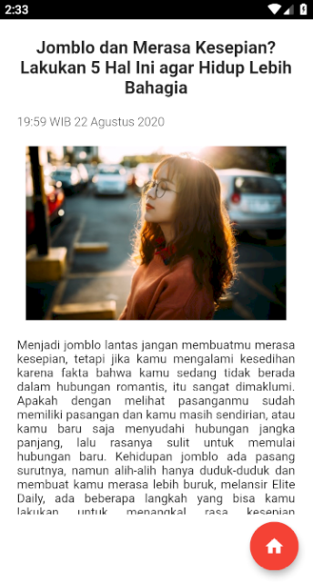
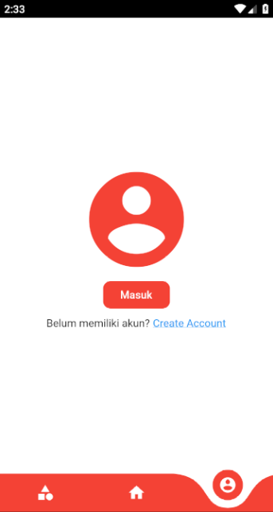
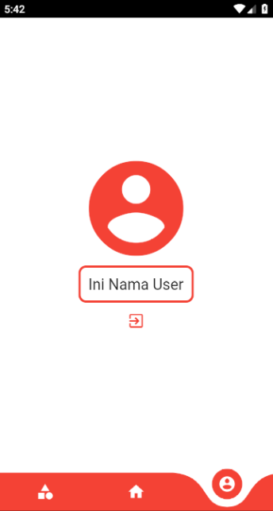
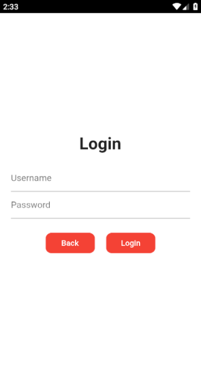
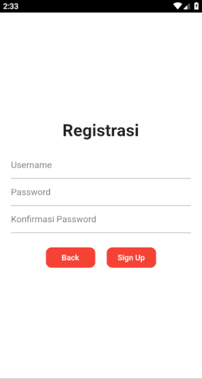

# portal_berita_lokerprogrammer
Project workshop pembuatan aplikasi portal berita menggunakan flutter. 

Tampilan Kategori
 

Tampilan Home
 

Tampilan Detail
 

Tampilan Profil (belum login)
 

Tampilan Profil (sudah login)
 

Tampilan FormLogin
 

Tampilan FormRegist
 

